# Các mô hình tư duy chiến lược

Các mô hình này được tổng hợp phần lớn từ "50 models for strategic thinking"

## SWOT analysis - Tìm phương án phù hợp

SWOT analysis phân tích 4 khía cạnh của 1 vấn đề:

- Strengths: Điểm mạnh
- Weakness: Điểm yếu
- Opportunities: Cơ hội
- Threat: Nguy cơ - Trong nguy chứa cơ

## BCG box - Phân tích chi phí và lợi nhuận

BCG box (Boston Consulting Group) xây dựng loại biểu đồ cho phép phân tích khoản đầu tư của doanh nghiệp thành 4 nhóm:

- Cash cows: Thị phần lớn nhưng tốc độ tăng trưởng thấp, cần tiếp tục nuôi dưỡng, giai đoạn này đem lại lợi nhuận cao
- Stars: Thị phần thấp nhưng tốc độ tăng trưởng cao - đẩy mạnh đầu tư
- Question mark: Tốc độ phát triển nhanh nhưng thị phần thấp. Nếu tiếp tục đầu tư sẽ tốn rất nhiều nguồn lực mới có thể trở thành *stars*
- Dogs: Thị phần thấp, tốc độ phát triển thấp - cần loại bỏ

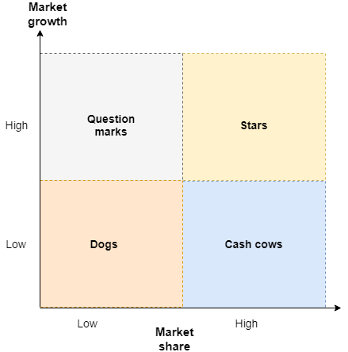{width=50%}

## Project portfolio - Duy trì tổng quan khi quản lý dự án

Kỹ thuật chia nhóm dự án thành 2 chiều - thời gian và chi phí - sẽ giúp ta luôn duy trì được tổng quan của nhiều công việc đang phải triển khai song song 

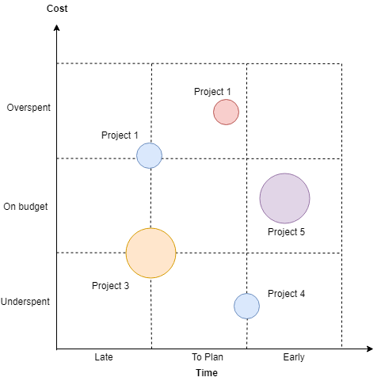{width=50%}

## Rubber band model - Giải quyết tình thế lưỡng nan

Khi phải đưa ra lựa chọn giữa 2 mô hình đều "tốt", hãy trả lời câu hỏi:

- Cái gì giữ ta lại
- Cái gì sẽ đẩy ta đi tiếp?

## Model choices - Giảm số lượng options

Khi có quá nhiều lựa chọn, chúng ta sẽ bị lúng túng. Mối quan hệ giữa lựa chọn và độ lúng túng như sau.

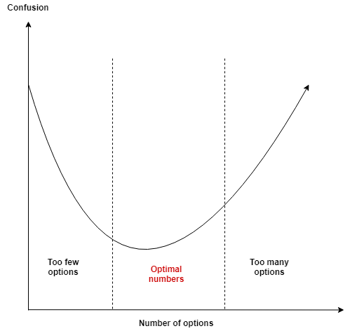{width=50%}

## Morphological box & scramber - ngăn nắp để sáng tạo

Quá trình sáng tạo có thể được tạo ra từ việc phân tích và tổ hợp những thứ đã có sẵn. Morphological box cho phép liệt kê tổ hợp của những thứ đã có sẵn để tạo ra 1 thứ mới.

Ví dụ phân tích thuộc tính các loại thấu chi.

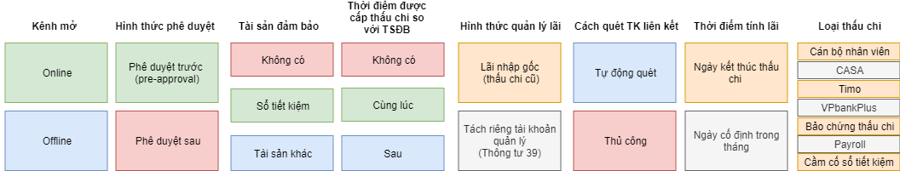{width=98%}

## Stop rule - Khi nào nên dừng lại

Trong một số trường hợp, ta cần đưa ra quy tắc để dừng lại. Ví dụ:

- Nếu đánh bạc thua/thắng 100$ thì phải dừng lại
- Nếu 2h chiều chưa lên đến đỉnh núi phải quay lại

## Flow model - Cái gì khiến ta hạnh phúc

Các nhà tâm lý đã phân tích ra rằng con người mong muốn hạnh phúc trên tất cả. Yếu tố khiến con người hành phúc đó là khi ta tập trung cao độ vào 1 hoạt động nhất định do mình tự lựa chọn, mà trong đó hoạt động này không quá dễ dàng (sinh ra nhàm chán) hoặc quá khó khăn (gây ra chán nản).

Hiện tượng này xảy ra khi quan sát nghệ sĩ, bác sĩ, ... tập trung vào công việc, say sưa và quên đi chính mình.

## Johari model - Người khác nghĩ về ta như thế nào

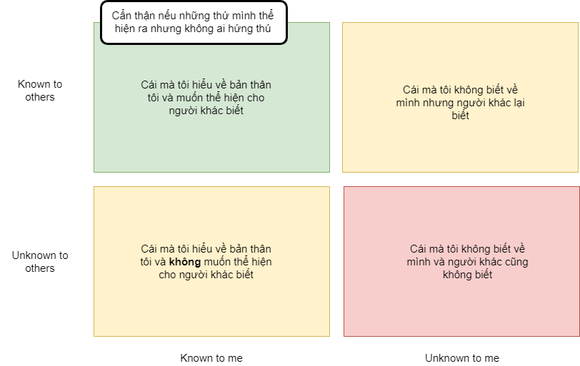{width=67%}

## Personal potential trap

Cái bẫy của những người được cho là có tiềm năng cao là rất lớn. Họ sẽ ngày càng gặp vấn đề khi kỳ vọng của mình, của người khác và kết quả thực sự ngày càng trở nên khác biệt.

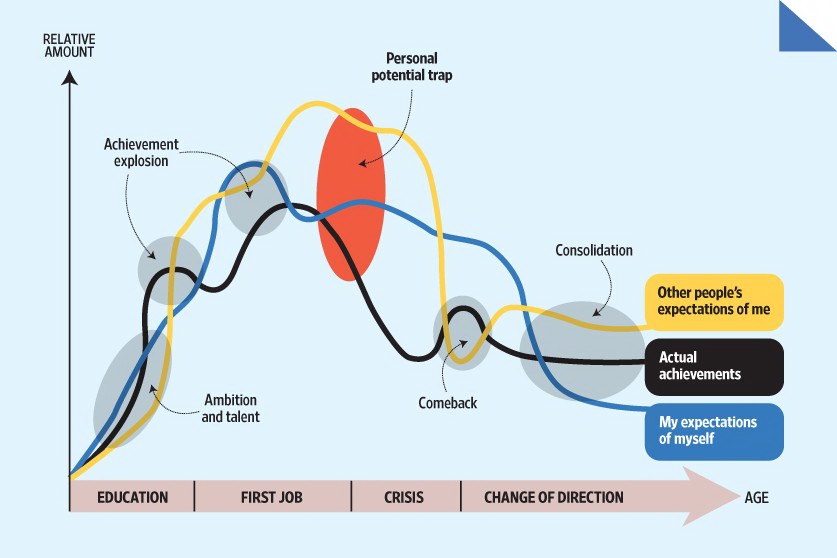{width=67%}

## Hard decision model - cách ra quyết định khi khó khăn

Mọi quyết định đều có thể được chia làm 2 thuộc tính: khả năng so sánh và hệ quả. Bốn nhóm vấn đề sẽ được chia thành ma trận như dưới đây.

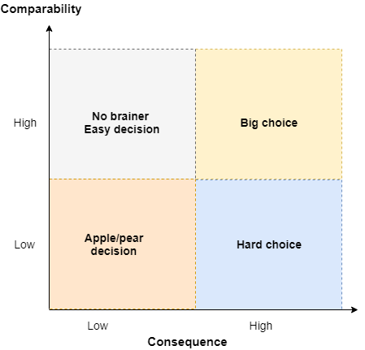{width=55%}

Ta sẽ gặp khó khăn khi ra quyết định khi mà tính so sánh thấp trong khi hệ quả lại cao (yêu hay không yêu, ...). Những trường hợp này việc phân tích không đem lại giá trị nhiều. 

## The crossroads model - Rồi sao nữa?

Mô hình này cho phép chúng ta tìm được hướng đi tiếp theo trong sự nghiệp/cuộc đời

**Tôi từ đâu đến đây**

- Tôi trở thành tôi hiện giờ như thế nào?
- Các quyết định quan trong, sự kiện và các trở ngại trong cuộc sống của tôi là gì?
- Ai là người ảnh hưởng đến bạn nhiều?

**Cái gì quan trọng với bạn**:

- Giá trị của bản thân là gì?
- Những nguyên tắc nào quan trọng với tôi?
- Nếu tất cả mọi thứ đều thất bại, cái gì sẽ là cái còn lại?

**Cái gì gây trở ngại cho bạn**:

**Cái gì khiến cho bạn sợ hãi**

## Rumsfeld Matrix - Phân tích rủi ro hiệu quả

Các loại rủi ro có thể được chia thành 4 nhóm dựa theo 2 tham số:

- Known
- Unknown

**Known knowns**: Rủi ro mà chúng ta biết và tìm cách phòng ngừa. Ví dụ: Trộm lấy cắp xe đạp, lừa đảo tín dụng

**Known Unknowns**: Chúng ta biết có rủi ro nhưng không thể dự báo được. Ví dụ: Chứng khoán sụt giảm

**Unknown Knowns**: Các nhà tâm lý học cho rằng, trong sâu thẳm chúng ta (tiềm thức, trực giác) có nhiều hơn những thứ chúng ta có thể suy nghĩ hiện tại.

**Unknown Unknown**: Những thứ ta thậm chí còn không biết là ta không biết. Ví dụ: Nhật tấn công Trân Châu Cảng

## THe cheese model - Sai lầm xuất phát từ đâu

Có ba loại lỗi:

- Real mistake: Sử dụng sai quy trình
- Black-outs: Không sử dụng 1 phần quy trình
- Slip-ups: Quy trình đúng nhưng thực hiện sai

Ba tầng lỗi:

- Tầng kỹ năng (skill-based level)
- Tầng quy trình (rule-based level)
- Tầng kiến thức (knowledge-based level)

Các nhân tố gây lỗi:

- Do con người
- Do hệ thống
- Do các thành phần cho tổ chức (VD: deadline, ...)
- Các nhân tố bên ngoài: Thời tiết, etc.

> Experience	is	the	name	everyone	gives	to	his	mistakes.	Oscar	Wilde

## Maslow model - Chúng ta cần những gì

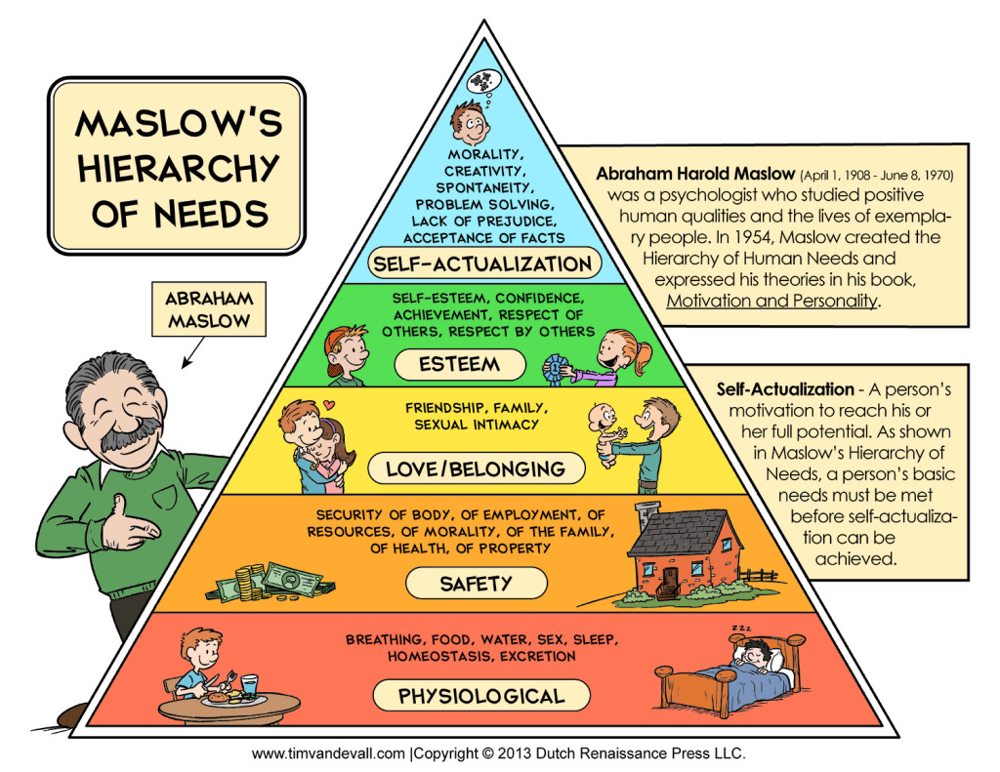{width=75%}

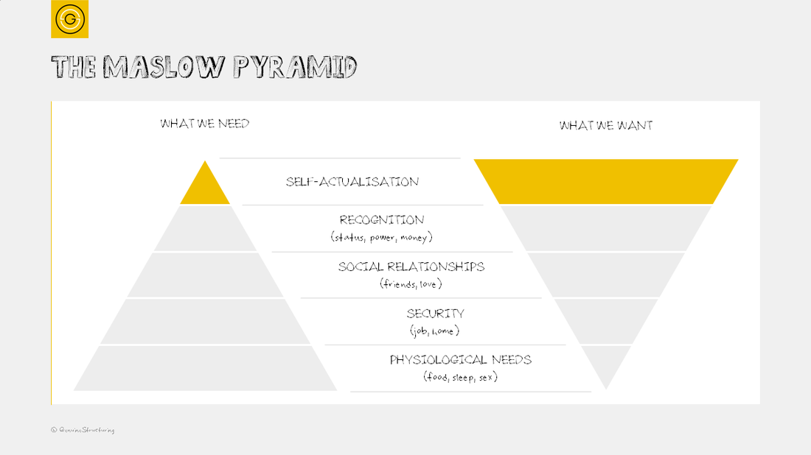{width=90%}

## The double-loop learning model - Học hỏi từ sai lầm

Có hai kiểu quan sát

- First-order observer: Những người này nhận thức thế giới thông qua những thứ xảy ra với họ, quan tâm đến "cái gì". Họ không biết "làm sao" họ lại rút ra được những kiến thức và kỹ năng như vậy. Khi các công việc lặp đi lặp lại, những người này thường sẽ đạt được trình độ cao. Tuy nhiên, nếu môi trường, cách thức hoạt động thay đổi, họ sẽ gặp nhiều khó khăn.
- Second-order observer: Quan tâm không chỉ đến what mà còn là "How" - Cách thức thế giới được vận hành

## AI model (Apprciative Inquery) - Phong cách tranh luận

Khi gặp vấn đề, ta có thể chia thành 4 nhóm người phụ thuộc vào cách họ phản ứng:

- Tích cực vs Tiêu cực
- Xây dựng vs. Cản trở

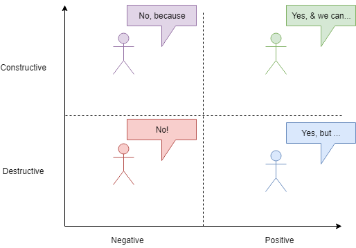{width=90%}

## Pareto model - bất đối xứng giữa nguyên nhân và hệ quả

20% người giàu chiếm 80% tỏng số tài sản

## Long tail model - Internet thay đổi hoạt động nền kinh tế như thế nào

Mô hình `long tail` cho phép giải thích sự tăng trưởng và phát triển của các thị trường ngách. Khi một ngành mới thành lập, khoảng 20% các công ty nổi tiếng nhất sẽ chiếm được 80% thị trường. Tuy nhiên, khi càng phát triển, số lượng sản phẩm ngày càng gia tăng và phát sinh nhu cầu cho các thị trường ngách

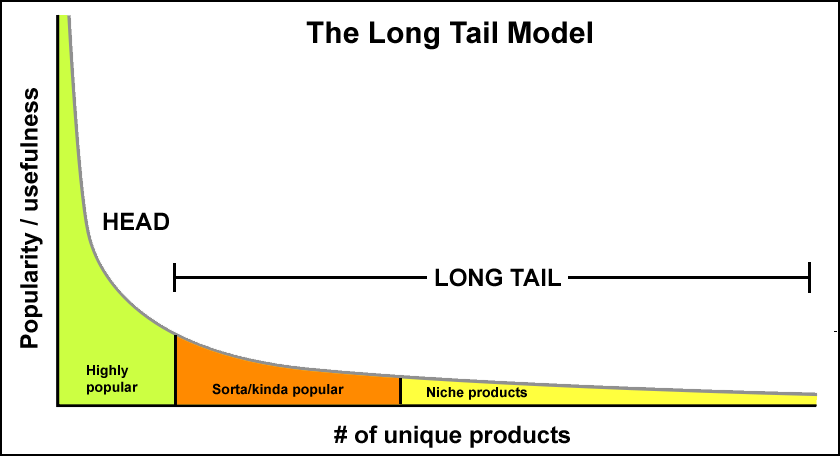{width=90%}

## Mô hình xử lý tranh chấp

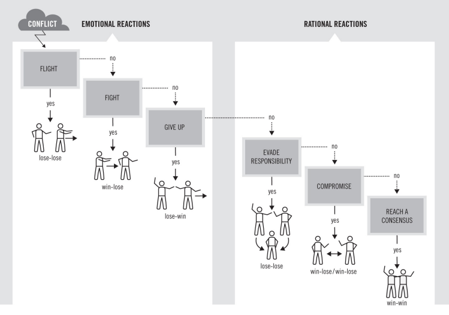{width=90%}

## Mô hình thiên nga đen

Các nhà sinh vật học châu Âu trước kia đều cho rằng thiên nga đều có màu trắng cho đến khi nhìn thấy 1 loài thiên nga đen. Từ đó, thuật ngữ thiên nga đen được dùng khi mô tả rằng con người không có khả năng dự báo trước được những nguy cơ có thể xảy ra 1 cách toàn diện

## The chasm - the diffusion model - Mô hình khuếch tán sản phẩm

Mô hình giải thích tại sao 1 ý tưởng ngu ngốc có thể trở nên phổ biến.

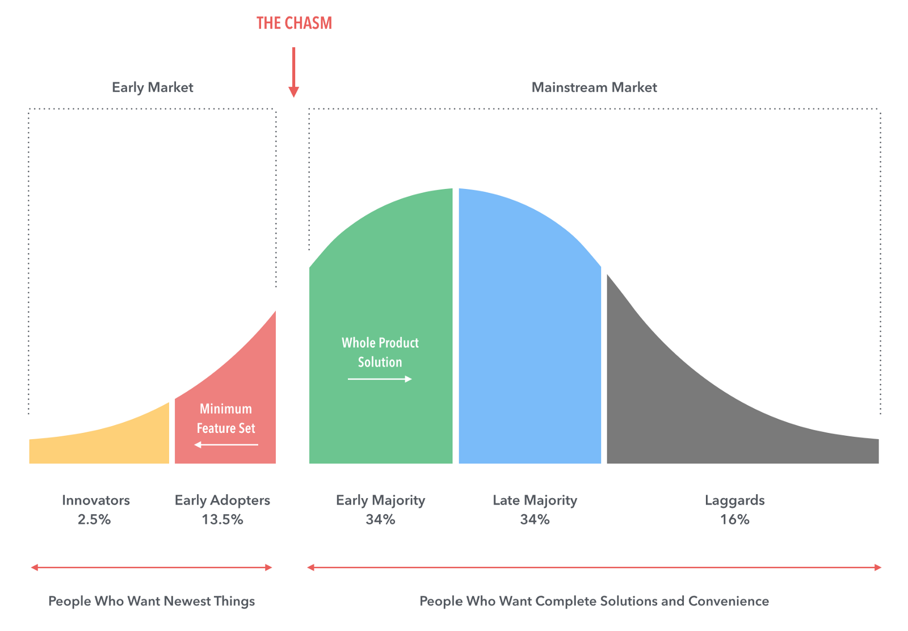{width=90%}

## The black box model - Niềm tin thay thế kiến thức

Khi mà sự phức tạp của vạn vật vận hành xung quanh ngày càng tăng, con người ngày càng ít có khả năng giải thích hoặc hiểu đầy đủ về mọi thứ xung quanh. Tuy nhiên, con người lại có khả năng *tích hợp* các sản phẩm, dịch vụ đó vào các quyết định hàng ngày. Ví dụ: Cách thức vận hành smartphone, cách máy tính hoạt động, etc.

Do đó, con người có xu hướng tin tưởng mà không cần hiểu hết mọi thứ. Dần dần, ta ngày càng gia tăng tầm quan trọng của nhũng người có thể giải thích đầy đủ vấn đề hơn là chính bản thân sự giải thích đó.

## The team model - Phân tích điểm mạnh của team

Để xác định rõ team có đủ kỹ năng cần thiết không, ta cần so sánh từng thành viên với điểm tối thiểu. Ví dụ: Scale từ 1-10, điểm để đạt được hiệu quả chấp nhận được mỗi kỹ năng là 5. Sức mạnh của team nằm ở sự khác biệt, không phải sự tương đồng.

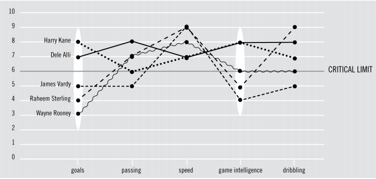{width=90%}

## Thay đổi góc nhìn của người khác - 6 chiếc mũ tư duy

Chia team thành 6 nhóm nhỏ, mỗi nhóm chỉ thể hiện 1 quan điểm.

- Mũ trắng: Phân tích, dựa trên số liệu và logic
- Mũ đỏ: Cảm xúc, ý tường
- Mũ đen: Chỉ trích, phản biện
- Mũ vàng: Lạc quan, suy tính đến trường hợp tốt nhất
- Màu xanh lá: Sáng tạo, xây dựng, đưa ra nhiều ý tưởng
- Màu xanh lục: Đưa ra bức tranh lớn, quy trình

## Result Optimization Model

Khi làm project, để đảm bảo kết quả tốt phải chia làm 3 phase với khoảng thời gian bằng nhau. Mỗi phase đều phải đi qua 3 giai đoạn:

- G (Gather ideas): Lấy ý tưởng
- C (Consolidate into a concept): Chuyển thành concepts
- I (Implementation): Triển khai

Để dự án thành công, dự án phải trải qua 3 lần `hoàn thành`

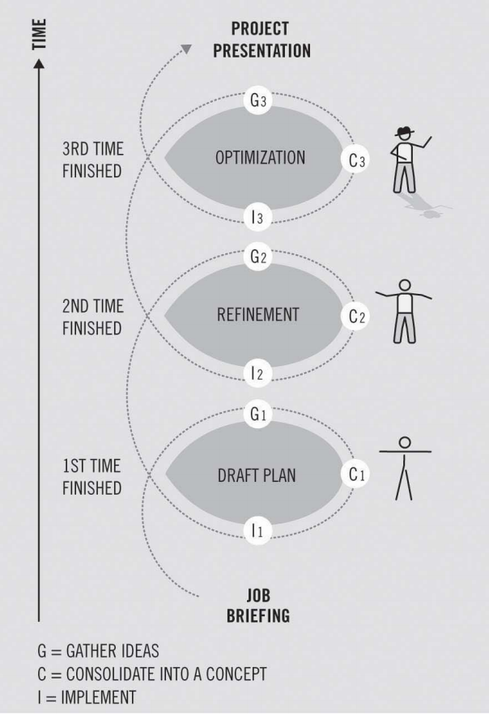{width=60%}

## Mô hình tam giác trong quản trị dự án 

Khi phân tích dự án, luôn có 3 thứ ta cần đánh đổi:

- Tốc độ nhanh chóng
- Giá thành phải chăng
- Chất lượng đảm bảo

Ta chỉ có thể duy trì được 2 trong 3 yếu tố

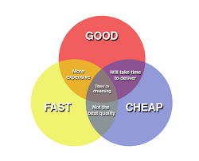{width=60%}

## Cách xây dựng team

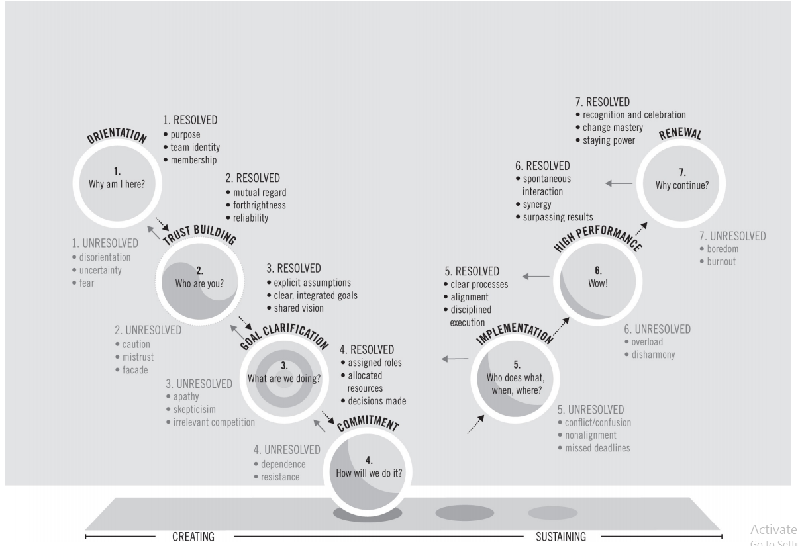{width=95%}

